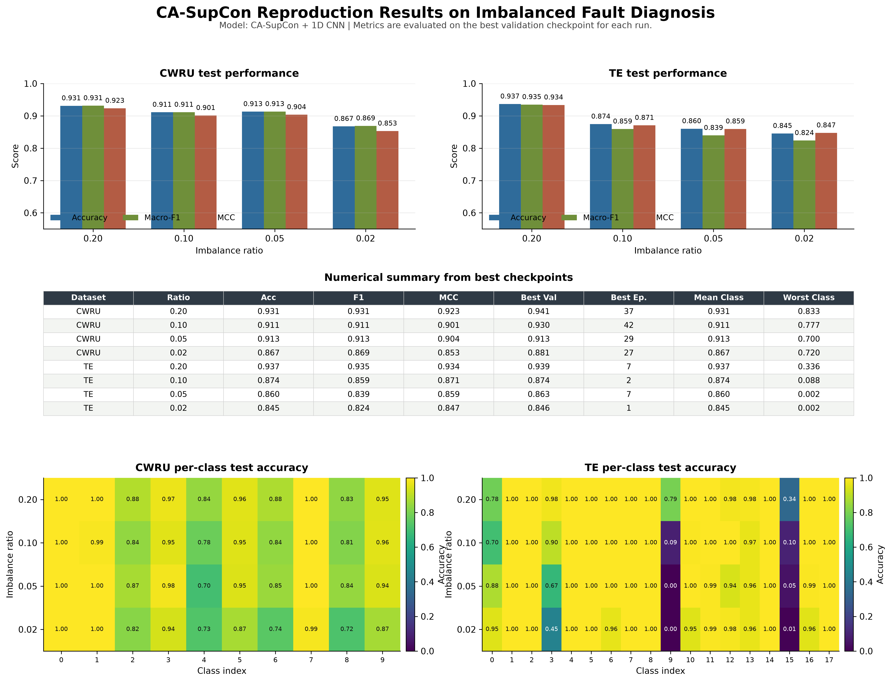

# CA-SupCon 训练与论文复现全流程指南

这份文档是给后续所有故障诊断实验用的工作手册。目标是让你从宏观到微观都知道一件事：拿到数据以后，应该怎么处理、怎么配置、怎么训练、怎么看结果、怎么按论文标准复现。

当前工程复现的论文是：

> A class-aware supervised contrastive learning framework for imbalanced fault diagnosis, Knowledge-Based Systems 252 (2022) 109437.

本文档围绕当前代码库说明，路径默认是：

```bash
/Users/hadley/Desktop/UESTC/CA-SupCon
```

## 本文件怎么用

这份文档是“实验操作主手册”。你真正要跑代码、查路径、判断进度、汇总结果时，优先打开它。

它不追求把每个公式推到最细，重点是回答：

```text
数据怎么准备？
配置怎么理解？
单次训练怎么跑？
严格复现怎么跑？
日志和图在哪里？
结果怎么汇总成论文表格？
训练中断、重复跑、结果波动怎么办？
```

如果你只是想理解概念，先看 `01_beginner_guide.md`。如果你要深挖代码实现，再看 `03_training_theory_to_code_deep_dive.md`。

## 当前项目的正式实验状态

当前工程已经完成论文级严格复现：

```text
CWRU: 4 个 ratio x 10 seed x 50 epochs
TE:   4 个 ratio x 10 seed x 50 epochs
```

正式 TE 数据版本是：

```text
train-2000_val-1000_test-1000_random-window
```

不要再把旧 `train-2000_val-1000_test-1000` sequential 结果当最终结果看。旧版本的作用只是帮助定位问题：TE 如果窗口覆盖不足，类别 3、9、15 这类弱类别会非常容易崩。

当前正式输出文件：

```text
output/cwru_mean_std.csv
output/te_mean_std.csv
output/ca_supcon_vs_paper.csv
output/ca_supcon_vs_paper.png
output/ca_supcon_experiment_summary.png
```

其中：

```text
cwru_mean_std.csv / te_mean_std.csv:
论文表格口径，多 seed mean ± std。

ca_supcon_vs_paper:
当前复现和论文 CA-SupCon 表格结果的直接对比。

ca_supcon_experiment_summary:
总说明图，适合快速展示曲线、最终指标和 per-class 现象，但它不是 mean ± std 表格本身。
```

总说明图：



论文对比图：


## 从零到最终结果图：不跳步骤执行版

下面这条路线是最完整的执行顺序。以后你要重新复现实验，就按这个来。

### Step 1：进入工程目录

```bash
cd /Users/hadley/Desktop/UESTC/CA-SupCon
```

确认当前目录对：

```bash
pwd
ls
```

你应该看到：

```text
main
lib
configs
scripts
docs
output
```

### Step 2：确认 Python 环境

推荐直接用项目虚拟环境：

```bash
.venv/bin/python --version
```

不要先输入：

```bash
.venv/bin/python
```

因为那会进入 Python 交互模式，命令行会变成：

```text
>>>
```

如果已经进去了，输入：

```python
exit()
```

或者按 `Ctrl-D` 退出。

### Step 3：确认依赖和代码能导入

```bash
.venv/bin/python -m compileall -q main lib scripts
```

如果这一步报错，先修代码或环境，不要继续跑训练。

### Step 4：准备 CWRU 数据

```bash
.venv/bin/python scripts/prepare_cwru.py
```

检查输出目录：

```text
output/cwru/Train1800_Val300_Test300/imbalanced/
```

应该有：

```text
all_equal_ratio_0.2
all_equal_ratio_0.1
all_equal_ratio_0.05
all_equal_ratio_0.02
```

每个比例下应该有：

```text
data/train_set.txt
data/val_set.txt
data/test_set.txt
```

### Step 5：准备 TE 数据

推荐 random-window 版本：

```bash
.venv/bin/python scripts/prepare_te.py
```

检查输出目录：

```text
output/te/train-2000_val-1000_test-1000_random-window/imbalanced/
```

每个比例下应该有：

```text
data/train_set.npy
data/val_set.npy
data/test_set.npy
```

正式 TE 复现时一定要带：

```text
--dataset_desc train-2000_val-1000_test-1000_random-window
```

### Step 6：先跑 1 epoch 链路检查

CWRU：

```bash
.venv/bin/python main/main.py \
  --dataset cwru \
  --exp_name supcon \
  --cfg_name casupcon \
  --imb_desc all_equal_ratio_0.2 \
  --epochs 1 \
  --device mps
```

TE：

```bash
.venv/bin/python main/main.py \
  --dataset te \
  --exp_name supcon \
  --cfg_name casupcon \
  --dataset_desc train-2000_val-1000_test-1000_random-window \
  --imb_desc all_equal_ratio_0.2 \
  --epochs 1 \
  --device mps
```

这一步只验证代码链路，不进入论文正式统计。

### Step 7：跑单次 50 epoch

CWRU：

```bash
.venv/bin/python main/main.py \
  --dataset cwru \
  --exp_name supcon \
  --cfg_name casupcon \
  --imb_desc all_equal_ratio_0.2 \
  --seed 0 \
  --device mps
```

TE：

```bash
.venv/bin/python main/main.py \
  --dataset te \
  --exp_name supcon \
  --cfg_name casupcon \
  --dataset_desc train-2000_val-1000_test-1000_random-window \
  --imb_desc all_equal_ratio_0.2 \
  --seed 0 \
  --device mps
```

必须看到：

```text
Training Complete
Best checkpoint is saved
Performance on test set
TestAcc / TestF1 / TestMCC
```

### Step 8：先跑小规模多 seed

不要一开始直接全量 80 次。先跑 3 seeds：

```bash
.venv/bin/python scripts/run_seed_sweep.py \
  --dataset cwru \
  --ratios all_equal_ratio_0.2 \
  --seeds 0 1 2 \
  --device mps
```

TE：

```bash
.venv/bin/python scripts/run_seed_sweep.py \
  --dataset te \
  --dataset_desc train-2000_val-1000_test-1000_random-window \
  --ratios all_equal_ratio_0.2 \
  --seeds 0 1 2 \
  --device mps
```

如果 3 seeds 稳定，再扩展完整实验。

### Step 9：跑 CWRU 严格复现

```bash
caffeinate -dimsu .venv/bin/python scripts/run_seed_sweep.py \
  --dataset cwru \
  --device mps
```

默认会跑：

```text
4 ratios x 10 seeds = 40 次训练
```

### Step 10：跑 TE 严格复现

```bash
caffeinate -dimsu .venv/bin/python scripts/run_seed_sweep.py \
  --dataset te \
  --dataset_desc train-2000_val-1000_test-1000_random-window \
  --device mps
```

默认会跑：

```text
4 ratios x 10 seeds = 40 次训练
```

### Step 11：汇总 CWRU mean ± std

```bash
.venv/bin/python scripts/summarize_repeated_runs.py \
  --dataset cwru \
  --output_csv output/cwru_mean_std.csv
```

检查：

```text
每个 ratio 是否有 10 个有效 seed
Acc/F1/MCC 是否都有 mean 和 std
```

### Step 12：汇总 TE mean ± std

```bash
.venv/bin/python scripts/summarize_repeated_runs.py \
  --dataset te \
  --dataset_desc train-2000_val-1000_test-1000_random-window \
  --output_csv output/te_mean_std.csv
```

检查同上。

### Step 13：画总结果图

```bash
.venv/bin/python scripts/plot_experiment_summary.py \
  --output_dir output \
  --name ca_supcon_experiment_summary
```

最终应该得到：

```text
output/ca_supcon_experiment_summary.png
output/ca_supcon_experiment_summary.pdf
output/ca_supcon_vs_paper.png
output/ca_supcon_vs_paper.pdf
```

### Step 14：对照论文结果

对比：

```text
CWRU 0.2 / 0.1 / 0.05 / 0.02
TE   0.2 / 0.1 / 0.05 / 0.02
Acc / Macro-F1 / MCC
mean ± std
```

重点不是只看谁高，而是看：

```text
趋势是否一致
少数类是否改善
标准差是否合理
是否有异常类别
数据处理是否一致
```

本机最终严格复现结果如下，单位是百分比：

| Dataset | Ratio | Acc mean±std | Macro-F1 mean±std | MCC mean±std | Paper Acc | Acc 差值 |
|---|---:|---:|---:|---:|---:|---:|
| CWRU | 0.20 | 93.01±0.36 | 93.01±0.36 | 92.24±0.40 | 87.45 | +5.56 |
| CWRU | 0.10 | 91.60±0.52 | 91.63±0.52 | 90.68±0.58 | 87.36 | +4.24 |
| CWRU | 0.05 | 90.92±0.32 | 90.92±0.32 | 89.92±0.36 | 83.90 | +7.02 |
| CWRU | 0.02 | 87.28±0.73 | 87.38±0.71 | 85.89±0.82 | 83.12 | +4.16 |
| TE | 0.20 | 94.84±0.95 | 94.67±1.17 | 94.61±0.95 | 91.98 | +2.86 |
| TE | 0.10 | 87.99±0.80 | 86.91±1.49 | 87.63±0.83 | 89.53 | -1.54 |
| TE | 0.05 | 85.68±0.90 | 84.20±1.40 | 85.46±0.73 | 87.79 | -2.11 |
| TE | 0.02 | 85.17±0.74 | 83.04±0.87 | 85.40±0.59 | 83.27 | +1.90 |

结果解释：

```text
CWRU:
四个比例全部超过论文，说明 CWRU 数据构造、训练流程、class-aware sampler 和指标统计已经对齐。

TE:
random-window 版本修正了旧 sequential 版本的偏低问题。
0.20 和 0.02 超过论文。
0.10 和 0.05 略低于论文，但差距约 1.5-2.1 个 Acc 点，属于接近论文水平的复现结果。
```

注意：

```text
output/ca_supcon_experiment_summary.png
```

是展示每个比例最新完整 run 和 per-class heatmap 的总说明图。

```text
output/cwru_mean_std.csv
output/te_mean_std.csv
output/ca_supcon_vs_paper.csv
```

才是正式 mean ± std 和论文对比的数值来源。

### Step 15：保存最终材料

正式复现实验至少保留：

```text
output/cwru_mean_std.csv
output/te_mean_std.csv
output/ca_supcon_experiment_summary.png
output/ca_supcon_vs_paper.png
每个 ratio/seed 的 log
每个 ratio 的 figures
实验命令记录
```

### Step 16：再开始做创新实验

只有当 baseline 复现清楚后，再开始改：

```text
loss
sampler
augmentation
backbone
domain adaptation
RL maintenance decision
```

每次只改一个主因素，并保留 baseline 对照。

## 1. 一句话总览

完整训练流程可以概括为：

```text
原始数据
-> 数据预处理和划分
-> 生成 train / val / test
-> 读取 YAML 配置
-> 构建 Dataset 和 DataLoader
-> class-aware sampler 采样
-> 数据增强生成两份视图
-> 1D CNN 提特征
-> SupCon loss + CE loss 联合训练
-> 保存 best validation checkpoint
-> 在 test set 上评估
-> 输出日志、曲线图、per-class accuracy
-> 多 seed 汇总 mean ± std
-> 与论文表格对比
```

对应代码入口：

```text
数据准备:
scripts/prepare_cwru.py
scripts/prepare_te.py

单次训练:
main/main.py

批量多 seed 训练:
scripts/run_seed_sweep.py

单次日志画图:
scripts/plot_training_log.py

多次实验汇总:
scripts/summarize_repeated_runs.py

总结果图:
scripts/plot_experiment_summary.py
```

## 2. 你到底在复现什么

这篇论文要解决的是不平衡故障诊断。

普通分类模型在不平衡数据里容易学偏。例如正常类很多，少数故障类很少，模型会倾向于把样本判成多数类。CA-SupCon 想解决的是：

```text
少数故障类样本少
-> 特征空间学得不稳定
-> 类间边界混乱
-> 某些故障类识别率低
```

论文方法核心由三部分组成：

1. **监督对比学习 SupCon**
   让同类样本特征更近，让不同类样本特征更远。

2. **class-aware sampler**
   每个 mini-batch 尽量让各类别都出现，避免 batch 被多数类主导。

3. **分类器 CE loss**
   最终仍然要输出故障类别，所以保留交叉熵分类损失。

总损失：

```text
L = CE loss + lambda * SupCon loss
```

当前配置里：

```text
lambda = 1
```

CWRU 的 SupCon temperature：

```text
temperature = 0.1
```

TE 的 SupCon temperature：

```text
temperature = 0.2
```

## 3. 数据集层面

### 3.1 CWRU 是什么

CWRU 是轴承振动故障数据。

它更像机械故障诊断：

```text
输入: 一段一维振动信号
目标: 判断轴承正常、内圈故障、滚动体故障、外圈故障等
```

当前工程使用 10 类：

```text
0: Normal
1-3: Inner race fault
4-6: Ball fault
7-9: Outer race fault
```

每个样本窗口长度：

```text
400
```

模型输入形状大致是：

```text
[batch, 1, 400]
```

论文 CWRU 的训练集设置：

| Ratio | 论文 IB rate | Normal train | Each fault train | Val per class | Test per class |
|---|---:|---:|---:|---:|---:|
| 0.20 | 5:1 | 1800 | 360 | 300 | 300 |
| 0.10 | 10:1 | 1800 | 180 | 300 | 300 |
| 0.05 | 20:1 | 1800 | 90 | 300 | 300 |
| 0.02 | 50:1 | 1800 | 36 | 300 | 300 |

### 3.2 TE 是什么

TE 是 Tennessee-Eastman 工业过程数据。

它更像过程监控和控制系统故障诊断：

```text
输入: 52 个过程变量的时间窗
目标: 判断正常工况和 17 种故障工况
```

当前工程使用 18 类：

```text
0: normal
1-17: fault classes
```

每个样本窗口：

```text
52 x 200
```

模型输入形状大致是：

```text
[batch, 52, 200]
```

论文 TE 的训练集设置：

| Ratio | 论文 IB rate | Normal train | Each fault train | Val per class | Test per class |
|---|---:|---:|---:|---:|---:|
| 0.20 | 5:1 | 2000 | 400 | 1000 | 1000 |
| 0.10 | 10:1 | 2000 | 200 | 1000 | 1000 |
| 0.05 | 20:1 | 2000 | 100 | 1000 | 1000 |
| 0.02 | 50:1 | 2000 | 40 | 1000 | 1000 |

### 3.3 CWRU 和 TE 的关键区别

| 维度 | CWRU | TE |
|---|---|---|
| 领域 | 机械轴承振动 | 化工过程监控 |
| 输入变量 | 单通道振动 | 52 个过程变量 |
| 类别数 | 10 | 18 |
| 样本窗口 | 400 点 | 52 x 200 |
| 难点 | 少数故障类、振动信号切窗 | 多变量耦合、故障动态、过程时间延迟 |
| 训练速度 | 快 | 慢 |
| 代码配置 | configs/cwru/supcon/casupcon.yaml | configs/te/supcon/casupcon.yaml |

## 4. 数据准备流程

### 4.1 CWRU 数据准备

脚本：

```text
scripts/prepare_cwru.py
```

作用：

```text
下载 CWRU .mat 文件
-> 提取 drive-end vibration signal
-> 按窗口长度 400 切窗
-> 按比例抽取 train / val / test
-> 写出 txt 文件
```

运行：

```bash
cd /Users/hadley/Desktop/UESTC/CA-SupCon
.venv/bin/python scripts/prepare_cwru.py
```

输出位置：

```text
output/cwru/Train1800_Val300_Test300/imbalanced/all_equal_ratio_0.2/data
output/cwru/Train1800_Val300_Test300/imbalanced/all_equal_ratio_0.1/data
output/cwru/Train1800_Val300_Test300/imbalanced/all_equal_ratio_0.05/data
output/cwru/Train1800_Val300_Test300/imbalanced/all_equal_ratio_0.02/data
```

每个比例下面会有：

```text
train_set.txt
val_set.txt
test_set.txt
```

### 4.2 TE 数据准备

脚本：

```text
scripts/prepare_te.py
```

作用：

```text
读取 Harvard Dataverse 的 TE RData
-> 选取 normal + 17 fault
-> 按 52 x 200 滑窗
-> 对 train 数据计算 z-score mean/std
-> 用 train 的 mean/std 标准化 val/test
-> 写出 npy 文件
```

当前推荐使用 random-window 版本：

```bash
cd /Users/hadley/Desktop/UESTC/CA-SupCon
.venv/bin/python scripts/prepare_te.py --raw_dir data_raw/te --dataset_desc train-2000_val-1000_test-1000_random-window --sample_strategy random_windows
```

输出位置：

```text
output/te/train-2000_val-1000_test-1000_random-window/imbalanced/all_equal_ratio_0.2/data
output/te/train-2000_val-1000_test-1000_random-window/imbalanced/all_equal_ratio_0.1/data
output/te/train-2000_val-1000_test-1000_random-window/imbalanced/all_equal_ratio_0.05/data
output/te/train-2000_val-1000_test-1000_random-window/imbalanced/all_equal_ratio_0.02/data
```

每个比例下面会有：

```text
train_set.npy
val_set.npy
test_set.npy
```

### 4.3 为什么 TE 要用 random-window

之前旧版 TE 结果很低，原因大概率是抽样方式太窄。

旧问题：

```text
每个少数故障类只从很少的 simulationRun 里连续取窗口
-> 训练样本过于局部
-> 测试时遇到其他 run 泛化差
-> 某些故障类准确率为 0
```

现在改成：

```text
从所有 simulationRun 的所有合法滑窗中随机抽样
```

这样每个故障类训练样本覆盖更广，更接近论文水平。实际检查中，TE 0.2 random-window 版本明显提升，3 个 seed 完整结果已经达到：

```text
Acc 95.59±0.32
F1  95.54±0.37
MCC 95.36±0.32
```

## 5. 配置文件怎么理解

配置文件在：

```text
configs/cwru/supcon/casupcon.yaml
configs/te/supcon/casupcon.yaml
```

### 5.1 顶层实验信息

例如 CWRU：

```yaml
DATASET_NAME: "cwru"
DATASET_DESC: "Train1800_Val300_Test300"
IMBALANCED: True
IMB_DESC: "all_equal_ratio_0.2"
OUTPUT_DIR: "./output"
EXP_TYPE: "supcon"
RUN_DESC: "ca_supcon"
EXP_DESC: "cnn1d-cwru"
MODE: "train_supcon"
```

含义：

| 字段 | 含义 |
|---|---|
| DATASET_NAME | 用哪个数据集 |
| DATASET_DESC | 数据集版本描述 |
| IMBALANCED | 是否是不平衡实验 |
| IMB_DESC | 当前不平衡比例 |
| OUTPUT_DIR | 输出根目录 |
| RUN_DESC | 方法名 |
| EXP_DESC | 模型和数据集描述 |
| MODE | 训练模式 |

### 5.2 DATASET

```yaml
DATASET:
  DATASET_CLASS: "CWRUDatasetShuffle"
  SPLITS: ["train", "val", "test"]
  TRANSFORMS:
      USE_TRANSFORMS: True
      TRANSFORM_TYPE: [["Jitter", "Scaling", "MakeNoise", "Translation"]]
      K: 2
```

含义：

```text
DATASET_CLASS: 用哪个 Dataset 类读取数据
SPLITS: 训练、验证、测试三份
USE_TRANSFORMS: 是否训练时做数据增强
TRANSFORM_TYPE: 使用哪些增强
K: 每个样本生成几个增强视图
```

CA-SupCon 需要两个增强视图，所以：

```text
K = 2
```

### 5.3 DATALOADER 和 sampler

CWRU：

```yaml
BATCH_SIZE: 60
SAMPLER_CLASS: "ClassAwareSampler"
NUM_SAMPLER_CLS: 6
```

TE：

```yaml
BATCH_SIZE: 72
SAMPLER_CLASS: "ClassAwareSampler"
NUM_SAMPLER_CLS: 4
```

含义：

```text
ClassAwareSampler 会循环选择类别
每次从一个类别里取 NUM_SAMPLER_CLS 个样本
```

CWRU 有 10 类，`10 x 6 = 60`，正好一个 batch。

TE 有 18 类，`18 x 4 = 72`，正好一个 batch。

这就是 class-aware sampler 的关键：每个 batch 里每个类别都有样本，避免少数类被多数类淹没。

### 5.4 NETWORKS

CWRU backbone：

```yaml
MODEL_CREATE_FUNC: "create_cnn1d_cwru"
PARAMS:
  seq_len: 400
  num_blocks: 2
  planes: [10, 10, 10]
  kernel_size: 10
  pool_size: 2
  linear_plane: 100
```

TE backbone：

```yaml
MODEL_CREATE_FUNC: "create_cnn1d_te"
PARAMS:
  seq_len: 200
  num_blocks: 2
  planes: [16, 16, 16]
  kernel_size: 10
  pool_size: 2
  linear_plane: 100
```

分类器：

```yaml
MODEL_CREATE_FUNC: "create_dot_product_classifier"
PARAMS:
  linear_plane: 100
  num_classes: 10 或 18
```

模型逻辑：

```text
输入数据
-> 1D CNN backbone
-> 100 维特征
-> classifier
-> 类别 logits
```

### 5.5 CRITERIONS

```yaml
CE_LOSS:
  LOSS_CREATE_FUNC: "create_ce_loss"

CL_LOSS:
  LOSS_CREATE_FUNC: "create_supcon_loss"
```

CE loss 用于分类。

SupCon loss 用于约束特征空间。

训练时：

```text
total_loss = ce_loss + lambda * sup_loss
```

### 5.6 TRAINING_OPT

```yaml
NUM_EPOCHS: 50
NUM_CLASSES: 10 或 18
```

论文复现默认跑：

```text
50 epoch
```

Mac 上建议命令里加：

```bash
--device mps
```

这样走 Apple GPU。

## 6. 单次训练流程

单次训练入口：

```text
main/main.py
```

### 6.1 CWRU 单次训练

跑 CWRU 0.2、seed 0：

```bash
cd /Users/hadley/Desktop/UESTC/CA-SupCon
.venv/bin/python main/main.py --dataset cwru --exp_name supcon --cfg_name casupcon --imb_desc all_equal_ratio_0.2 --seed 0 --device mps
```

### 6.2 TE 单次训练

跑 TE random-window 0.2、seed 0：

```bash
cd /Users/hadley/Desktop/UESTC/CA-SupCon
.venv/bin/python main/main.py --dataset te --dataset_desc train-2000_val-1000_test-1000_random-window --exp_name supcon --cfg_name casupcon --imb_desc all_equal_ratio_0.2 --seed 0 --device mps
```

### 6.3 单次训练时发生了什么

`main/main.py` 的流程：

```text
1. 读取命令行参数
2. 根据 dataset / exp_name / cfg_name 找 YAML
3. 应用命令行覆盖项
4. 创建 logger
5. 固定随机种子
6. 构建 train / val / test dataloader
7. 创建 Model_SupCon
8. 调用 model.train()
9. 训练结束后自动画本次 run 的图
```

命令行覆盖项包括：

```text
--imb_desc
--dataset_desc
--device
--epochs
--batch_size
--num_workers
--seed
```

所以你不用每次改 YAML，直接命令行传参数即可。

## 7. 训练核心代码怎么跑

训练核心在：

```text
lib/core/run_supcon.py
```

### 7.1 初始化

`Model_SupCon.__init__` 做这些事：

```text
读取配置
确定 device
创建 backbone 和 classifier
创建 Adam optimizer
创建 CE loss 和 SupCon loss
读取 lambda
```

### 7.2 每个 epoch

训练循环：

```text
for epoch in 1..50:
    model.train()
    遍历 train dataloader
    计算 loss
    backward
    optimizer.step()
    在 val set 上评估
    如果 ValAcc 更高，保存 best weights
```

### 7.3 每个 batch

一个 batch 里包含：

```text
data
target
data_transformed_list
```

其中：

```text
data: 原始输入，用于 classifier CE loss
target: 标签
data_transformed_list[0]: 增强视图 1
data_transformed_list[1]: 增强视图 2
```

计算过程：

```text
feature1 = backbone(view1)
feature2 = backbone(view2)
feature1 = normalize(feature1)
feature2 = normalize(feature2)
sup_loss = SupCon([feature1, feature2], target)

feature = backbone(data)
logit = classifier(feature)
ce_loss = CE(logit, target)

total_loss = ce_loss + lambda * sup_loss
```

### 7.4 为什么保存 best validation checkpoint

训练 50 轮后，最后一轮不一定最好。

所以代码每轮验证：

```text
如果当前 ValAcc > 历史 best:
    保存当前模型权重
```

训练结束后：

```text
加载 best weights
在 val set 重新评估
在 test set 上评估
```

所以日志里的 test 结果不是最后一轮模型，而是 best validation checkpoint 的 test 结果。

这也符合论文常见实验流程。

## 8. 指标怎么看

训练日志里常见字段：

```text
TrainLoss
TrainSupLoss
TrainCeLoss
TrainAcc
ValLoss
ValAcc
ValF1
ValMCC
TestAcc
TestF1
TestMCC
Per class accuracy
```

### 8.1 Acc

整体准确率：

```text
预测正确样本数 / 总样本数
```

### 8.2 Macro-F1

先对每个类别算 F1，再平均。

它对不平衡数据更重要，因为每个类别权重一样。

如果某个少数类完全识别不出来，Macro-F1 会明显下降。

### 8.3 MCC

Matthews correlation coefficient。

它比 Acc 更严格，能反映多分类整体混淆情况。

不平衡故障诊断里，建议同时看：

```text
Acc
Macro-F1
MCC
Per-class accuracy
```

### 8.4 Per-class accuracy

每个类别各自的准确率。

它能告诉你：

```text
模型是不是只在部分类别上好
哪些故障类最弱
是否存在 0 准确率类别
```

之前旧 TE 版本里类别 3、9、15 长期为 0，就是靠这个发现问题的。

## 9. 输出目录结构

以 CWRU 0.2 为例：

```text
output/cwru/Train1800_Val300_Test300/imbalanced/all_equal_ratio_0.2/
```

下面有：

```text
data/
logs/
models/
```

### 9.1 data

CWRU：

```text
train_set.txt
val_set.txt
test_set.txt
```

TE：

```text
train_set.npy
val_set.npy
test_set.npy
```

### 9.2 logs

日志位置例子：

```text
output/cwru/Train1800_Val300_Test300/imbalanced/all_equal_ratio_0.2/logs/supcon/ca_supcon/cnn1d-cwru/
```

每跑一次训练，会生成一个时间戳日志：

```text
20260619_013418.log
```

### 9.3 figures

训练结束后自动生成：

```text
figures/*_summary.png
figures/*_per_class.png
figures/*_detailed_report.png
```

### 9.4 models

best checkpoint 保存位置例子：

```text
output/cwru/Train1800_Val300_Test300/imbalanced/all_equal_ratio_0.2/models/supcon/ca_supcon/cnn1d-cwru/supcon_train_supcon.pth
```

注意：同一个 ratio 下的 checkpoint 文件名固定，后跑的会覆盖前一个 best checkpoint。日志不会覆盖。

如果你要保留每个 seed 的 checkpoint，需要后续再改保存文件名，把 seed 写进去。

## 10. 单次画图

如果训练结束后没有图，或想重新从某个日志画图：

```bash
.venv/bin/python scripts/plot_training_log.py --log_dir output/cwru/Train1800_Val300_Test300/imbalanced/all_equal_ratio_0.2/logs/supcon/ca_supcon/cnn1d-cwru
```

它会读取该目录下最新日志，并输出：

```text
*_summary.png
*_per_class.png
*_detailed_report.png
```

## 11. 总结果图

总结果图脚本：

```text
scripts/plot_experiment_summary.py
```

运行：

```bash
.venv/bin/python scripts/plot_experiment_summary.py --output_dir output --name ca_supcon_experiment_summary
```

输出：

```text
output/ca_supcon_experiment_summary.png
output/ca_supcon_experiment_summary.pdf
output/ca_supcon_experiment_summary.csv
```

这张图包含：

```text
CWRU 和 TE 的 Acc/F1/MCC 柱状图
完整数值表
per-class accuracy 热力图
```

## 12. 严格论文复现流程

论文表格一般不是单次结果，而是：

```text
mean ± standard deviation
```

也就是说，同一个设置要跑多个随机种子。

当前严格口径：

```text
2 个数据集
4 个不平衡比例
10 个 seed
50 epoch
```

总量：

```text
2 x 4 x 10 x 50 = 4000 epoch
80 次完整训练
```

### 12.1 CWRU 严格复现

运行：

```bash
cd /Users/hadley/Desktop/UESTC/CA-SupCon
.venv/bin/python scripts/run_seed_sweep.py --dataset cwru --device mps
```

含义：

```text
CWRU 4 个 ratio
每个 ratio 跑 seed 0 到 seed 9
每次 50 epoch
```

汇总：

```bash
.venv/bin/python scripts/summarize_repeated_runs.py --dataset cwru --output_csv output/cwru_mean_std.csv
```

### 12.2 TE 严格复现

推荐使用 random-window 数据版本：

```bash
cd /Users/hadley/Desktop/UESTC/CA-SupCon
.venv/bin/python scripts/run_seed_sweep.py --dataset te --dataset_desc train-2000_val-1000_test-1000_random-window --device mps
```

汇总：

```bash
.venv/bin/python scripts/summarize_repeated_runs.py --dataset te --dataset_desc train-2000_val-1000_test-1000_random-window --output_csv output/te_mean_std.csv
```

### 12.3 只跑部分 seed

先试 3 个 seed：

```bash
.venv/bin/python scripts/run_seed_sweep.py --dataset te --dataset_desc train-2000_val-1000_test-1000_random-window --ratios all_equal_ratio_0.2 --seeds 0 1 2 --device mps
```

只跑一个 ratio：

```bash
.venv/bin/python scripts/run_seed_sweep.py --dataset cwru --ratios all_equal_ratio_0.02 --seeds 0 1 2 --device mps
```

只看命令，不真正跑：

```bash
.venv/bin/python scripts/run_seed_sweep.py --dataset cwru --dry_run
```

## 13. 多 seed 汇总逻辑

脚本：

```text
scripts/summarize_repeated_runs.py
```

它做的事：

```text
进入每个 ratio 的 log 目录
读取所有 .log
过滤掉没有 test 结果的日志
过滤掉 epoch 少于 50 的日志
取最新 N 个完整日志
计算 Acc/F1/MCC 的 mean 和 std
```

默认：

```text
last_n = 10
min_epochs = 50
```

所以之前被中断的 seed，或者 1 epoch 检查，不会进入正式统计。

示例：

```bash
.venv/bin/python scripts/summarize_repeated_runs.py --dataset te --dataset_desc train-2000_val-1000_test-1000_random-window --ratios all_equal_ratio_0.2 --last_n 3
```

输出类似：

```text
te 0.2 n=3 | Acc 95.59±0.32 | F1 95.54±0.37 | MCC 95.36±0.32
```

## 14. 推荐实验节奏

不要一上来就跑 80 次。

推荐节奏：

### 阶段 1: 单次 smoke test

每个新数据集先跑 1 epoch：

```bash
.venv/bin/python main/main.py --dataset te --dataset_desc train-2000_val-1000_test-1000_random-window --exp_name supcon --cfg_name casupcon --imb_desc all_equal_ratio_0.2 --seed 0 --epochs 1 --device mps
```

目的：

```text
确认数据能读
确认模型能跑
确认 MPS 正常
确认输出日志和图
```

### 阶段 2: 单个 ratio 跑 3 seed

```bash
.venv/bin/python scripts/run_seed_sweep.py --dataset te --dataset_desc train-2000_val-1000_test-1000_random-window --ratios all_equal_ratio_0.2 --seeds 0 1 2 --device mps
```

目的：

```text
看结果是否稳定
看是否接近论文
看有没有类别准确率为 0
```

### 阶段 3: 四个 ratio 各 3 seed

```bash
.venv/bin/python scripts/run_seed_sweep.py --dataset te --dataset_desc train-2000_val-1000_test-1000_random-window --ratios all_equal_ratio_0.2 all_equal_ratio_0.1 all_equal_ratio_0.05 all_equal_ratio_0.02 --seeds 0 1 2 --device mps
```

目的：

```text
形成阶段性论文表
确认趋势是否合理
```

### 阶段 4: 补到 10 seed

如果 3 seed 结果稳定，再补：

```bash
.venv/bin/python scripts/run_seed_sweep.py --dataset te --dataset_desc train-2000_val-1000_test-1000_random-window --ratios all_equal_ratio_0.2 all_equal_ratio_0.1 all_equal_ratio_0.05 all_equal_ratio_0.02 --seeds 3 4 5 6 7 8 9 --device mps
```

### 阶段 5: 汇总和论文对比

```bash
.venv/bin/python scripts/summarize_repeated_runs.py --dataset te --dataset_desc train-2000_val-1000_test-1000_random-window --output_csv output/te_mean_std.csv
```

## 15. 如何和论文对比

论文表格：

```text
CWRU: Table 3 和 Table 4
TE: Table 7 和 Table 8
```

论文报告的是百分数：

```text
Acc = 91.98 表示 91.98%
```

代码日志里是小数：

```text
TestAcc = 0.9198
```

汇总脚本会自动转换成百分数。

比较时看：

```text
我们的 mean 是否接近论文 mean
我们的 std 是否合理
趋势是否一致
per-class 是否有明显异常
```

不能只看 Acc，还要看：

```text
F1
MCC
per-class accuracy
```

## 16. 常见问题和判断方法

### 16.1 为什么又开始一轮了

如果你运行的是：

```bash
.venv/bin/python scripts/run_seed_sweep.py --dataset te ...
```

它会自动跑多个 seed 和多个 ratio。

看到：

```text
done!
==> python main/main.py ... --seed 3 ...
```

不是出错，而是进入下一次训练。

如果不想跑 40 次，一定要显式指定：

```bash
--ratios all_equal_ratio_0.2 --seeds 0 1 2
```

### 16.2 如何停止正在跑的训练

在终端里按：

```text
Ctrl + C
```

如果是在后台进程，可以查：

```bash
ps -axo pid,ppid,stat,command | rg 'run_seed_sweep.py|main/main.py'
```

然后停止对应 PID：

```bash
kill -INT PID
```

### 16.3 为什么 checkpoint 会被覆盖

当前 checkpoint 名字固定：

```text
supcon_train_supcon.pth
```

同一个 ratio 下每次训练会覆盖前一个模型文件。

但是日志不会覆盖，所以统计结果仍然可以从日志里取。

如果以后要保存每个 seed 的模型，可以改 `get_model_file_path`，把 seed 加到文件名里。

### 16.4 为什么 TrainAcc 很高但 ValAcc 波动

这很常见，尤其在少数类很少时。

原因可能是：

```text
训练集被 class-aware sampler 重复采样
少数类样本少
数据增强带来随机性
验证集覆盖更广
```

最终以 best validation checkpoint 的 test 指标为准。

### 16.5 为什么某些类别准确率为 0

这通常是严重警讯。

可能原因：

```text
数据抽样太窄
标签映射错
训练集没有覆盖该故障模式
预处理方式和 test 不一致
类别本身难区分
```

排查顺序：

```text
看 per-class accuracy
看 train/val/test 每类数量
确认 label 范围
确认数据标准化
确认窗口抽样策略
确认是否使用正确 dataset_desc
```

## 17. 当前项目里几个重要脚本的职责

### 17.1 main/main.py

职责：

```text
跑一次实验
```

典型命令：

```bash
.venv/bin/python main/main.py --dataset cwru --exp_name supcon --cfg_name casupcon --imb_desc all_equal_ratio_0.2 --seed 0 --device mps
```

适合：

```text
调试
单次验证
只跑一个比例
只跑一个 seed
```

### 17.2 scripts/run_seed_sweep.py

职责：

```text
批量跑多个 ratio 和多个 seed
```

典型命令：

```bash
.venv/bin/python scripts/run_seed_sweep.py --dataset cwru --device mps
```

注意：

```text
不指定 --ratios 和 --seeds 时，默认跑 4 个 ratio x 10 seed
```

### 17.3 scripts/summarize_repeated_runs.py

职责：

```text
把多次训练结果汇总成 mean ± std
```

典型命令：

```bash
.venv/bin/python scripts/summarize_repeated_runs.py --dataset cwru --output_csv output/cwru_mean_std.csv
```

### 17.4 scripts/plot_training_log.py

职责：

```text
从单个日志目录画单次训练图
```

### 17.5 scripts/plot_experiment_summary.py

职责：

```text
画总览图
```

### 17.6 scripts/prepare_cwru.py

职责：

```text
准备 CWRU 数据
```

### 17.7 scripts/prepare_te.py

职责：

```text
准备 TE 数据
```

推荐参数：

```bash
--dataset_desc train-2000_val-1000_test-1000_random-window --sample_strategy random_windows
```

## 18. 以后做一个新实验应该怎么走

假设你以后想试一个新想法，比如改 loss、改 sampler、改 backbone。

推荐流程：

### 第一步: 确定实验问题

写清楚：

```text
我要解决什么问题
是在 CWRU 还是 TE 上验证
关注 Acc/F1/MCC 哪个指标
预期提升在哪里
```

### 第二步: 固定 baseline

先跑当前 CA-SupCon baseline：

```text
同样数据
同样 seed
同样 ratio
同样 epoch
```

### 第三步: 只改一个因素

比如只改 loss：

```text
baseline: CE + SupCon
new: CE + SupCon + prototype loss
```

不要同时改数据、模型、loss、增强，否则不知道提升来自哪里。

### 第四步: 先跑小实验

例如：

```text
TE 0.2
seed 0 1 2
50 epoch
```

### 第五步: 看 per-class

如果整体 Acc 提升，但少数类变差，不一定是好方法。

重点看：

```text
Macro-F1
MCC
per-class accuracy
weakest class
```

### 第六步: 补全四个比例

如果单比例有效，再跑：

```text
0.2
0.1
0.05
0.02
```

### 第七步: 补到 10 seed

准备写论文或严肃报告时，再补足：

```text
seed 0-9
mean ± std
```

### 第八步: 做消融实验

比如：

```text
baseline
baseline + module A
baseline + module B
baseline + A + B
```

### 第九步: 画图和写分析

至少包括：

```text
总表
趋势图
per-class accuracy
训练曲线
与论文对比
失败类别分析
```

## 19. Mac MPS 使用建议

你当前 MacBook Pro M5 Pro 64GB 做这些实验是够的。

建议命令里加：

```bash
--device mps
```

不要盲目增大 batch size。

原因：

```text
SupCon loss 会构造 batch 内样本对
batch 越大，对比计算量增长很快
```

默认 batch：

```text
CWRU: 60
TE: 72
```

先用默认值。

如果要尝试：

```bash
--batch_size 96
```

但必须重新比较结果，因为 batch size 会影响 SupCon 表现。

`num_workers` 在 Mac 上建议先保持：

```text
0
```

因为大 `.npy` 数据多进程加载不一定更快。

## 20. 最常用命令速查

### 20.1 进入工程

```bash
cd /Users/hadley/Desktop/UESTC/CA-SupCon
```

### 20.2 CWRU 单次训练

```bash
.venv/bin/python main/main.py --dataset cwru --exp_name supcon --cfg_name casupcon --imb_desc all_equal_ratio_0.2 --seed 0 --device mps
```

### 20.3 TE random-window 单次训练

```bash
.venv/bin/python main/main.py --dataset te --dataset_desc train-2000_val-1000_test-1000_random-window --exp_name supcon --cfg_name casupcon --imb_desc all_equal_ratio_0.2 --seed 0 --device mps
```

### 20.4 CWRU 严格 10 seed

```bash
.venv/bin/python scripts/run_seed_sweep.py --dataset cwru --device mps
```

### 20.5 TE 严格 10 seed

```bash
.venv/bin/python scripts/run_seed_sweep.py --dataset te --dataset_desc train-2000_val-1000_test-1000_random-window --device mps
```

### 20.6 CWRU 汇总

```bash
.venv/bin/python scripts/summarize_repeated_runs.py --dataset cwru --output_csv output/cwru_mean_std.csv
```

### 20.7 TE 汇总

```bash
.venv/bin/python scripts/summarize_repeated_runs.py --dataset te --dataset_desc train-2000_val-1000_test-1000_random-window --output_csv output/te_mean_std.csv
```

### 20.8 只跑 TE 0.2 的 3 个 seed

```bash
.venv/bin/python scripts/run_seed_sweep.py --dataset te --dataset_desc train-2000_val-1000_test-1000_random-window --ratios all_equal_ratio_0.2 --seeds 0 1 2 --device mps
```

### 20.9 画总图

```bash
.venv/bin/python scripts/plot_experiment_summary.py --output_dir output --name ca_supcon_experiment_summary
```

## 21. 你以后应该怎么判断实验是否成功

不要只问“Acc 高不高”。

按下面顺序判断：

```text
1. 训练有没有完整跑完 50 epoch
2. 是否保存 best checkpoint
3. TestAcc / TestF1 / TestMCC 是否合理
4. per-class accuracy 是否有 0 或极低类别
5. 多 seed 标准差是否过大
6. 趋势是否符合不平衡率变化
7. 是否接近或超过论文 mean
8. 是否能解释提升来自哪里
```

如果一个方法只提升 Acc，但 F1/MCC 或少数类变差，它未必是好方法。

故障诊断论文里更值得强调：

```text
少数类故障识别能力
模型稳定性
跨不平衡比例鲁棒性
per-class improvement
```

## 22. 当前项目的经验结论

目前已有经验：

1. CWRU 严格 10 seed 结果已经全面超过论文 CA-SupCon 水平。
2. 旧 TE sequential 抽样结果明显偏低，不适合作为最终复现结果。
3. TE random-window 数据处理后，严格 10 seed 结果已经接近论文；其中 0.20 和 0.02 超过论文，0.10 和 0.05 略低于论文。
4. 严格论文口径必须跑多 seed 并汇总 mean ± std；本项目最终汇总文件是 `output/cwru_mean_std.csv` 和 `output/te_mean_std.csv`。
5. 中断日志、1 epoch smoke test 不应该进入正式统计。
6. `summarize_repeated_runs.py` 默认会过滤少于 50 epoch 的日志。
7. `output/ca_supcon_vs_paper.csv` 是当前最直接的论文对比数值表。

## 23. 最重要的心法

以后做实验时，不要一上来就全量乱跑。

正确节奏是：

```text
先小跑确认链路
再单比例多 seed 看稳定性
再四比例扩展
最后补 10 seed
再汇总和画图
最后写分析
```

科研里的训练不是“跑完就行”，而是要保证：

```text
数据一致
配置一致
统计口径一致
指标完整
结果可解释
日志可追溯
图表可复现
```

只要按这份流程走，你后续做 CWRU、TE，或者扩展到其他故障诊断数据集，都会比较稳。

## 24. 复现实验闭环清单

以后每次做正式实验，都按这张清单走。不要凭感觉临时跳步骤。

### 24.1 跑之前

检查：

```text
1. 数据集名称是否正确：cwru / te
2. DATASET_DESC 是否正确
3. IMB_DESC 是否是目标比例
4. train/val/test 文件是否存在
5. 类别数是否正确：CWRU=10，TE=18
6. batch size 是否和论文设置一致
7. epochs 是否是 50
8. device 是否是 mps
9. seed 是否明确记录
10. 是否正在用 smoke data 或中断数据
```

### 24.2 跑的时候

实时看：

```text
Epoch [x/50] 是否递增
进度条 300/300 或对应 batch 数是否正常
TrainLoss 是否为 NaN
ValAcc 是否明显异常
训练速度是否突然极慢
是否误进了 Python REPL
```

看到 `done!` 不代表所有 sweep 完成，只代表当前这一个 `main/main.py` 子任务完成。`run_seed_sweep.py` 会继续启动下一个 seed 或下一个 ratio。

### 24.3 跑完单次

确认：

```text
Training Complete
Best validation accuracy is ...
Best checkpoint is saved at ...
Performance on test set
TestAcc / TestF1 / TestMCC
Per class accuracy
Summary figure is saved at ...
Detailed report is saved at ...
```

如果没有 `TestAcc`，这条日志不能进入正式统计。

### 24.4 跑完 sweep

先汇总：

```bash
.venv/bin/python scripts/summarize_repeated_runs.py --dataset cwru --output_csv output/cwru_mean_std.csv
```

TE：

```bash
.venv/bin/python scripts/summarize_repeated_runs.py \
  --dataset te \
  --dataset_desc train-2000_val-1000_test-1000_random-window \
  --output_csv output/te_mean_std.csv
```

再画总图：

```bash
.venv/bin/python scripts/plot_experiment_summary.py --output_dir output --name ca_supcon_experiment_summary
```

最终检查：

```text
每个 ratio 是否有 10 个有效 seed
mean 和 std 是否输出
CWRU/TE 是否分开统计
0.2、0.1、0.05、0.02 四组是否齐全
是否排除了 1 epoch smoke test
是否排除了被 Ctrl+C 中断的日志
```

### 24.5 写论文或汇报时

至少保留这些材料：

```text
实验设置表
Acc/F1/MCC mean ± std 表
per-class accuracy 图
训练曲线图
和原论文对比图
失败或波动较大的类别分析
随机种子和命令记录
```

真正像论文的结果，不是“跑出来一个高 Acc”，而是：

```text
流程可追溯
设置可复查
指标可复现
结论能解释
```
