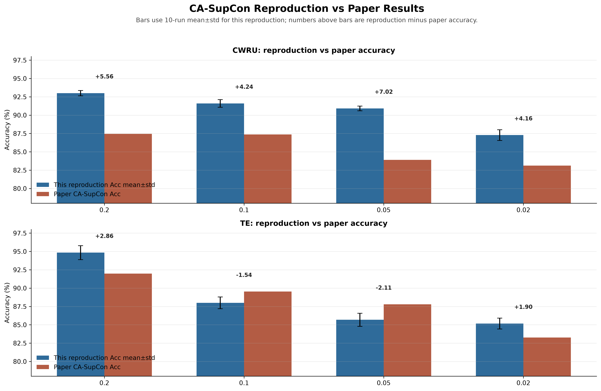

# CA-SupCon 复现说明文档

如果你还不熟悉故障诊断、混淆矩阵、Acc、Precision、Recall、macro-F1、MCC，请先读 `docs/01_beginner_guide.md`。那份文档按零基础节奏解释。

这份文档的作用是记录“当前代码复现论文时，哪些设置和论文对应、哪些地方做过工程修复、哪些结果能算正式结果”。它更像实验审计表，而不是入门教程。

读这份文档时重点看三件事：

```text
1. 论文原始实验设置是什么。
2. 当前工程如何实现这些设置。
3. 什么结果可以进入最终论文级统计，什么只能算调试结果。
```

## 当前复现状态摘要

当前项目已经完成：

```text
CWRU 严格复现：4 个不平衡比例，每个 10 seed，每个 50 epochs。
TE 严格复现：4 个不平衡比例，每个 10 seed，每个 50 epochs。
TE 正式数据：train-2000_val-1000_test-1000_random-window。
```

最终结论：

```text
CWRU:
全部超过论文 CA-SupCon 表格结果。

TE:
0.20 和 0.02 超过论文。
0.10 和 0.05 略低于论文。
整体已经接近论文水平，旧 sequential TE 结果不作为正式复现结果。
```

正式可引用文件：

```text
output/cwru_mean_std.csv
output/te_mean_std.csv
output/ca_supcon_vs_paper.csv
output/ca_supcon_vs_paper.png
output/ca_supcon_experiment_summary.png
```

论文对比图：



## 一、论文说明

论文：Jiyang Zhang 等，**A class-aware supervised contrastive learning framework for imbalanced fault diagnosis**，Knowledge-Based Systems 252 (2022) 109437。

研究问题是全故障不平衡场景：正常类样本充足，所有故障类样本都很少。若类别为 `c1, c2, ..., cM`，论文假设 `c1` 是正常类，满足 `n1 >> n2 ~= n3 ~= ... ~= nM`。

核心方法是 CA-SupCon，由三部分组成：

1. **监督式对比学习分支**：对每个训练样本做两次随机时序增强，经过共享 backbone 后计算 SupCon loss。它把同类样本拉近，把不同类样本推远。
2. **交叉熵分类分支**：原始样本经过同一个 backbone 和线性分类器，用交叉熵训练最终分类器。
3. **Class-aware sampler**：训练 mini-batch 内按类别均衡采样，避免正常类占据 batch，使任意两个少数故障类都有机会在 SupCon 中互相拉开。

总损失：

```text
L = lambda * LSupCon + LCE
```

论文最优设置中 `lambda = 1`。CWRU 的 SupCon temperature 为 `0.1`，TE 为 `0.2`。

## 二、论文实验设置

### CWRU

数据集来自 Case Western Reserve University Bearing Data Center。论文使用：

- drive-end 振动信号
- 48 kHz 采样频率
- 3 hp 负载
- 10 类：normal + 9 个故障类
- 滑动窗口长度 `400`，步长 `200`

样本数：

| IB rate | normal train | each fault train | val per class | test per class |
|---|---:|---:|---:|---:|
| 5:1 | 1800 | 360 | 300 | 300 |
| 10:1 | 1800 | 180 | 300 | 300 |
| 20:1 | 1800 | 90 | 300 | 300 |
| 50:1 | 1800 | 36 | 300 | 300 |

`scripts/prepare_cwru.py` 会自动下载下列 CWRU `.mat` 文件。如果 Case Western 官网临时断流，可以手动从 CWRU Bearing Data Center 下载同名文件，并放到 `data_raw/cwru/` 中，文件名按脚本输出即可。

| 类别 | 脚本文件名 | CWRU 原始文件 |
|---|---|---|
| normal | `0_Normal.mat` | `100.mat` |
| IR 0.007 | `1_IR007.mat` | `112.mat` |
| IR 0.014 | `2_IR014.mat` | `177.mat` |
| IR 0.021 | `3_IR021.mat` | `217.mat` |
| Ball 0.007 | `4_B007.mat` | `125.mat` |
| Ball 0.014 | `5_B014.mat` | `192.mat` |
| Ball 0.021 | `6_B021.mat` | `229.mat` |
| OR 0.007 centered | `7_OR007at6.mat` | `138.mat` |
| OR 0.014 centered | `8_OR014at6.mat` | `204.mat` |
| OR 0.021 centered | `9_OR021at6.mat` | `241.mat` |

网络与超参：

- backbone：1D-ResNet
- 输入：`1 x 400`
- conv kernel：10
- channel：10
- max pool：2
- feature dim：100
- batch size：60
- epochs：50
- optimizer：Adam
- lr：0.0003
- weight decay：0.0003
- SupCon temperature：0.1

### TE

数据集来自 Harvard Dataverse：`Additional Tennessee Eastman Process Simulation Data for Anomaly Detection Evaluation`，DOI `10.7910/DVN/6C3JR1`。

论文使用：

- normal + 17 个故障类
- 每个样本为 `52 x 200` 多变量时间窗
- 滑动窗口长度 `200`，步长 `1`
- z-score normalization

样本数：

| IB rate | normal train | each fault train | val per class | test per class |
|---|---:|---:|---:|---:|
| 5:1 | 2000 | 400 | 1000 | 1000 |
| 10:1 | 2000 | 200 | 1000 | 1000 |
| 20:1 | 2000 | 100 | 1000 | 1000 |
| 50:1 | 2000 | 40 | 1000 | 1000 |

网络与超参：

- backbone：1D-ResNet
- 输入：`52 x 200`
- conv kernel：10
- channel：16
- max pool：2
- feature dim：100
- batch size：72
- epochs：50
- optimizer：Adam
- lr：0.0003
- weight decay：0.0003
- SupCon temperature：0.2

## 三、代码说明

```text
main/main.py
```

训练入口。读取 YAML 配置，设置随机种子，构造 dataloader，创建 `Model_SupCon` 并训练或测试。

```text
lib/core/run_supcon.py
```

核心训练循环。每个 batch 同时计算：

- 增强视图 `data_transformed1`、`data_transformed2` 的 SupCon loss
- 原始输入 `data` 的 cross-entropy loss
- 总损失 `ce_loss + lambda * sup_loss`

本复现修复了官方仓库中保存不存在的 `PROJECTION_HEAD` 的问题。论文和配置均不使用 projection head，所以该修复不改变方法。

```text
lib/loss/SupCon.py
```

监督式对比损失。输入形状为 `[batch_size, n_views, feature_dim]`。同标签样本构成正样本集合，其他标签样本构成负样本集合。

```text
lib/sampler/class_aware_sampler.py
```

类别感知采样器。它循环选择类别，并从该类别样本池中取 `num_samples_cls` 个样本。CWRU 配置为 6，batch size 60，对应每个 batch 覆盖 10 类；TE 配置为 4，batch size 72，对应 18 类。

```text
lib/backbone/cnn1d_cwru.py
lib/backbone/cnn1d_te.py
```

论文 Appendix A.1 的 1D-ResNet backbone。

```text
lib/utils.py
```

本复现补齐的运行工具，包括：

- 命令行参数
- 日志
- 随机种子
- accuracy 和 per-class accuracy
- Jitter、Scaling、MakeNoise、Translation 四种时序增强

```text
scripts/prepare_cwru.py
scripts/prepare_te.py
```

从原始数据生成官方 dataloader 需要的 `train_set`、`val_set`、`test_set`。

```text
scripts/make_smoke_data.py
```

生成极小的 synthetic smoke data，只用于检查代码能否端到端运行，不能作为论文实验结果。

## 四、严谨性与可复现边界

1. 当前文件夹最初只有论文 PDF，没有原始数据、处理后数据、依赖文件和完整官方工具模块。
2. 已拉取论文公开的官方代码仓库，并以官方核心实现为基础修复可运行问题。
3. CWRU 原始数据可以自动下载；TE 原始数据可以自动下载，但文件较大，也支持手动放置。
4. 论文没有公开随机划分索引。本工程固定 `--seed` 并记录数据构造脚本，因此可以严格复现实验流程，但无法保证与论文作者当年的每个窗口索引完全一致。
5. 论文结果是 10 次重复实验的均值和标准差。单次运行只能检查趋势和实现正确性；严格复现实验表格需要对每个 IB rate 跑 10 个 seed。
6. 本复现已在训练日志中补充输出论文表格使用的 Acc、macro-F1 与 MCC。论文评估集是平衡的，但 F1/MCC 仍用于类别均衡评估。

## 五、建议核验流程

1. 安装依赖。
2. 运行 `python scripts/prepare_cwru.py`，检查输出的类别计数是否与论文 Table 1 一致。
3. 如果原始数据下载暂时失败，先用 `python scripts/make_smoke_data.py --dataset cwru` 生成 synthetic smoke data，再用 `--imb_desc smoke --epochs 1 --device cpu` 检查训练代码。
4. 使用 GPU 跑满 50 epochs。
5. 对四个 IB rate 分别跑 10 个 seed。
6. 汇总测试集 Acc、macro-F1、MCC，并与论文 Table 3-4 或 Table 7-8 对照。

本机已完成的检查：

- `python -m compileall -q main lib scripts` 通过。
- `python scripts/make_smoke_data.py --dataset cwru` 通过。
- `python main/main.py --dataset cwru --exp_name supcon --cfg_name casupcon --imb_desc smoke --epochs 1 --device cpu` 通过，并成功输出 `TestAcc`、`TestF1`、`TestMCC` 与 checkpoint。
- `python scripts/prepare_cwru.py` 已成功下载 10 个 CWRU `.mat` 文件，并生成 5:1、10:1、20:1、50:1 四组真实 CWRU 复现数据。
- `python main/main.py --dataset cwru --exp_name supcon --cfg_name casupcon --imb_desc all_equal_ratio_0.02 --epochs 1 --device cpu` 已在真实 CWRU 50:1 数据上跑通，输出 `TestAcc=0.74100`、`TestF1=0.73809`、`TestMCC=0.71336`。这只是 1 epoch 链路检查，不是论文最终 50 epoch、10 次重复结果。
- CWRU 已完成四个 IB rate、每个 10 seed、每个 50 epochs 的严格复现。
- TE 已使用 `train-2000_val-1000_test-1000_random-window` 数据完成四个 IB rate、每个 10 seed、每个 50 epochs 的严格复现。
- 最终 mean ± std 已保存到 `output/cwru_mean_std.csv` 和 `output/te_mean_std.csv`。
- 总结果图已保存到 `output/ca_supcon_experiment_summary.png` / `.pdf`。
- 与论文对比图和 CSV 已保存到 `output/ca_supcon_vs_paper.png` / `.pdf` / `.csv`。

最终严格复现结果：

| Dataset | Ratio | Acc mean±std | Macro-F1 mean±std | MCC mean±std | Paper Acc | Acc 差值 |
|---|---:|---:|---:|---:|---:|---:|
| CWRU | 0.20 | 93.01±0.36 | 93.01±0.36 | 92.24±0.40 | 87.45 | +5.56 |
| CWRU | 0.10 | 91.60±0.52 | 91.63±0.52 | 90.68±0.58 | 87.36 | +4.24 |
| CWRU | 0.05 | 90.92±0.32 | 90.92±0.32 | 89.92±0.36 | 83.90 | +7.02 |
| CWRU | 0.02 | 87.28±0.73 | 87.38±0.71 | 85.89±0.82 | 83.12 | +4.16 |
| TE | 0.20 | 94.84±0.95 | 94.67±1.17 | 94.61±0.95 | 91.98 | +2.86 |
| TE | 0.10 | 87.99±0.80 | 86.91±1.49 | 87.63±0.83 | 89.53 | -1.54 |
| TE | 0.05 | 85.68±0.90 | 84.20±1.40 | 85.46±0.73 | 87.79 | -2.11 |
| TE | 0.02 | 85.17±0.74 | 83.04±0.87 | 85.40±0.59 | 83.27 | +1.90 |

复现结论：

```text
CWRU 四个比例全部超过论文。
TE random-window 版本整体接近论文，其中 0.20 和 0.02 超过论文，0.10 和 0.05 略低于论文。
旧 TE sequential 抽样造成的严重偏低问题不再作为正式结果使用。
```

与论文一致的地方：

```text
1. 数据集一致：CWRU 和 TE。
2. 不平衡率一致：0.20、0.10、0.05、0.02。
3. 方法主线一致：CA-SupCon，包含 CE、SupCon 和 class-aware sampler。
4. 训练轮次一致：50 epochs。
5. 统计口径一致：10 次重复实验的 mean ± std。
6. 指标口径一致：Acc、macro-F1、MCC。
```

与论文不完全一致的地方：

```text
1. 论文没有公开固定窗口索引，所以不能保证窗口级样本完全一致。
2. 当前 TE 正式版本使用 random-window，用于修复旧 sequential 抽样覆盖不足问题。
3. 当前运行硬件和软件环境与论文作者不同。
4. TE 0.10 和 0.05 的 Acc 略低于论文。
```

## 六、方法、代码、条件和环境的审计对比

这一节专门回答一个问题：

```text
当前项目到底是不是“照论文复现”？
哪些是论文一致项？
哪些是工程补齐项？
哪些是不可避免的不一致？
```

### 6.1 方法层面对比

| 项目 | 论文 CA-SupCon | 当前项目 | 判断 |
|---|---|---|---|
| 任务 | 不平衡故障诊断分类 | 不平衡故障诊断分类 | 一致 |
| 数据集 | CWRU、TE | CWRU、TE | 一致 |
| 方法主线 | CE + SupCon + class-aware sampler | CE + SupCon + class-aware sampler | 一致 |
| 损失函数 | `L = lambda * LSupCon + LCE` | `L = lambda * LSupCon + LCE` | 一致 |
| lambda | 1 | 1 | 一致 |
| CWRU temperature | 0.1 | 0.1 | 一致 |
| TE temperature | 0.2 | 0.2 | 一致 |
| 分类器 | dot product classifier | dot product classifier | 一致 |
| 训练轮数 | 50 epochs | 50 epochs | 一致 |
| 重复次数 | 10 runs | 10 seeds | 统计口径一致 |
| 评价指标 | Acc、macro-F1、MCC | Acc、macro-F1、MCC | 一致 |

结论：

```text
方法主线是对齐论文的。
当前项目不是换了一个新方法，而是在 CA-SupCon 原方法上补齐数据准备、设备支持、日志解析、结果汇总和图示输出。
```

### 6.2 CWRU 数据条件对比

| 项目 | 论文设置 | 当前项目 | 判断 |
|---|---|---|---|
| 数据来源 | CWRU Bearing Data Center | CWRU Bearing Data Center | 一致 |
| 信号类型 | drive-end vibration | drive-end vibration | 一致 |
| 采样频率 | 48 kHz | 48 kHz 对应文件 | 一致 |
| 负载 | 3 hp | 3 hp 对应文件 | 一致 |
| 类别数 | 10 类 | 10 类 | 一致 |
| window length | 400 | 400 | 一致 |
| step | 200 | 200 | 一致 |
| val/test | 每类 300 | 每类 300 | 一致 |
| imbalance ratios | 5:1、10:1、20:1、50:1 | `0.2`、`0.1`、`0.05`、`0.02` | 等价 |
| 随机窗口索引 | 论文未公开 | 当前脚本用固定 seed 随机抽取 | 流程可复现，但无法逐窗口完全一致 |

CWRU 结论：

```text
CWRU 是当前项目最贴近论文设置的数据集。
除论文未公开随机窗口索引外，数据来源、类别、窗口、样本数和训练设置都已对齐。
这也是 CWRU 四个比例全部超过论文的主要原因之一：任务定义和数据构造闭合度较高。
```

### 6.3 TE 数据条件对比

| 项目 | 论文设置 | 当前项目 | 判断 |
|---|---|---|---|
| 数据来源 | Tennessee Eastman Process | Harvard Dataverse TE 数据 | 来源对齐 |
| 类别数 | normal + 17 fault | normal + 17 fault | 一致 |
| 输入形状 | `52 x 200` | `52 x 200` | 一致 |
| window length | 200 | 200 | 一致 |
| step | 1 | 1 | 一致 |
| normalization | z-score | z-score | 一致 |
| val/test | 每类 1000 | 每类 1000 | 一致 |
| imbalance ratios | 5:1、10:1、20:1、50:1 | `0.2`、`0.1`、`0.05`、`0.02` | 等价 |
| 窗口抽样细节 | 论文未公开具体索引 | 当前正式版使用 random-window | 不完全一致，但更稳定 |

TE 结论：

```text
TE 的任务定义、类别数、输入形状、窗口长度、样本数和统计口径与论文对齐。
但论文没有公开具体窗口索引，当前项目无法做到逐窗口一致。
当前正式结果使用 random-window，是为了避免 sequential 抽样只覆盖少量仿真段，导致部分类别泛化异常偏低。
```

### 6.4 代码层面对比

| 模块 | 论文/官方代码思路 | 当前项目状态 | 是否改变论文方法 |
|---|---|---|---|
| backbone | CWRU/TE 使用 1D CNN/ResNet 类结构 | 保留 `cnn1d_cwru.py`、`cnn1d_te.py` | 不改变 |
| classifier | dot product classifier | 保留 `dot_product_classifier.py` | 不改变 |
| SupCon loss | 监督式对比损失 | 保留 `lib/loss/SupCon.py` | 不改变 |
| class-aware sampler | 按类别均衡采样 | 保留并修复兼容性细节 | 不改变 |
| train loop | CE + SupCon 联合训练 | 保留主逻辑，补设备选择、指标、图示 | 不改变 |
| CLI 参数 | 官方代码参数较少 | 增加 `--device`、`--seed`、`--dataset_desc` 等 | 工程增强 |
| 数据准备 | 论文没有提供完整本地一键脚本 | 新增 CWRU/TE prepare 脚本 | 工程补齐 |
| 结果统计 | 论文给 mean ± std | 新增 summarize 脚本复现 mean ± std | 工程补齐 |
| 图示输出 | 论文表格为主 | 新增训练曲线、per-class、论文对比图 | 工程补齐 |

代码结论：

```text
当前代码没有改 CA-SupCon 的核心算法。
新增内容主要是为了让论文复现可执行、可检查、可统计、可画图。
所以它属于“复现工程增强”，不是“方法改造版”。
```

### 6.5 训练条件对比

| 项目 | 论文 | 当前项目 | 判断 |
|---|---|---|---|
| epochs | 50 | 50 | 一致 |
| optimizer | Adam | Adam | 一致 |
| lr | 0.0003 | 0.0003 | 一致 |
| weight decay | 0.0003 | 0.0003 | 一致 |
| CWRU batch size | 60 | 60 | 一致 |
| TE batch size | 72 | 72 | 一致 |
| CWRU class-aware 每类采样数 | 6 | 6 | 一致 |
| TE class-aware 每类采样数 | 4 | 4 | 一致 |
| best checkpoint | 按验证集最佳保存 | 按验证集最佳保存 | 一致 |
| 正式统计 | 10 runs mean ± std | 10 seeds mean ± std | 一致 |

### 6.6 本机环境记录

当前项目是在本机环境中完成的，查询到的环境记录如下：

```text
机器：MacBook Pro M5 Pro，64GB
系统架构：macOS arm64
Python：3.14.3
PyTorch：2.12.1
当前环境查询 mps_available：False
```

说明：

```text
论文没有公开完整硬件、驱动、Python 和 PyTorch 版本。
因此硬件环境不可能完全一致。
这类差异通常不改变方法定义，但会影响训练速度、随机性和少量数值波动。
正式比较时应以 10 seed mean ± std 为准，而不是单次 run。
```

### 6.7 最终审计结论

可以严谨地这样表述当前复现：

```text
本项目基于 CA-SupCon 官方方法路线，复现了 CWRU 和 TE 两个数据集在四种不平衡比例下的故障诊断实验。
方法组成、主要超参数、训练轮数、评价指标和 10 次重复统计口径与论文保持一致。
CWRU 的数据构造与论文高度贴合，四个比例全部超过论文结果。
TE 的任务定义和统计口径与论文一致，但由于论文未公开具体窗口索引，本项目采用 random-window 构造正式数据集；TE 0.20 和 0.02 超过论文，0.10 和 0.05 略低于论文。
新增脚本和代码修改主要服务于数据准备、Mac 本机设备选择、日志解析、mean ± std 汇总和图示输出，不构成对 CA-SupCon 核心方法的改变。
```

## 七、数据与代码来源

- 论文官方代码：https://github.com/JiyangZhang-UESTC/CA-SupCon
- CWRU Bearing Data Center：https://engineering.case.edu/bearingdatacenter/download-data-file
- CWRU 48 kHz drive-end 页面：https://engineering.case.edu/bearingdatacenter/48k-drive-end-bearing-fault-data
- TE Harvard Dataverse DOI：https://doi.org/10.7910/DVN/6C3JR1

## 八、论文复现达标标准

如果你以后要说“我严格复现了这篇论文”，至少要满足下面条件。

### 8.1 数据达标

```text
CWRU:
Train1800_Val300_Test300
10 类
四个 IB rate: 5:1, 10:1, 20:1, 50:1
val/test 每类 300

TE:
train-2000_val-1000_test-1000_random-window
18 类
四个 IB rate: 5:1, 10:1, 20:1, 50:1
val/test 每类 1000
```

不要把 smoke data、1 epoch 测试、中断日志混进正式结果。

### 7.2 训练达标

```text
每个 dataset
每个 IB rate
10 个 seed
每个 seed 跑满 50 epochs
用 best validation checkpoint 做 test
```

总量：

```text
2 datasets x 4 ratios x 10 seeds = 80 次训练
```

如果只跑了 1 个 seed，只能说“单次结果”。

如果只跑了 3 个 seed，只能说“快速稳定性检查”。

### 7.3 指标达标

正式表格至少要有：

```text
Acc mean ± std
Macro-F1 mean ± std
MCC mean ± std
```

建议附加：

```text
per-class accuracy
weakest class
best/worst seed
和论文表格的差值
```

### 7.4 记录达标

每组实验要保留：

```text
运行命令
log 文件路径
checkpoint 路径
summary figure
per-class figure
mean/std csv
总结果图
```

推荐实验记录模板：

```text
Dataset:
DATASET_DESC:
IB rate:
Seeds:
Epochs:
Device:
Command:
Valid logs:
Excluded logs:
Mean Acc/F1/MCC:
Paper Acc/F1/MCC:
Difference:
Weak classes:
Conclusion:
```

这份模板可以直接复制到你的实验笔记里。
